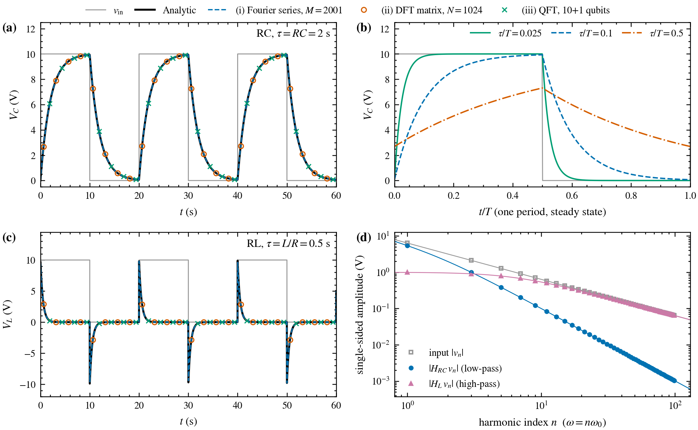
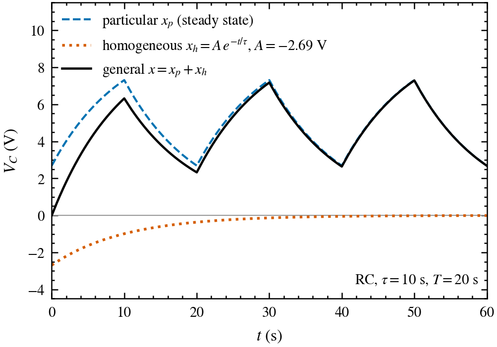
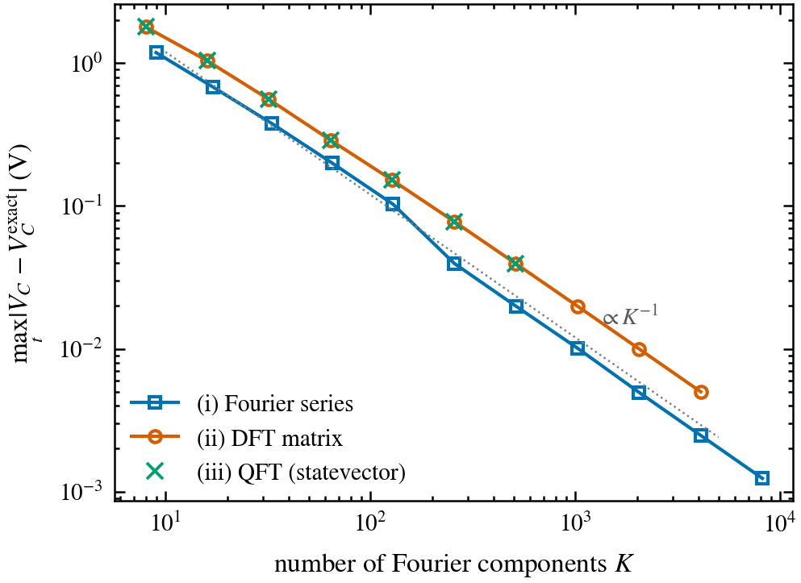

# Square-Wave Response of RC and RL Circuits via Fourier Methods

This repository computes the voltage response $`V(t)`$ of first-order **RC** and **RL** circuits driven by a square wave. The general solution is split into a particular solution (the periodic steady state, obtained in the frequency domain) and a homogeneous solution (the decaying transient, fixed by the initial condition). The particular solution is computed in three independent ways:

| | Method | Core operation | File |
|---|---|---|---|
| (i) | Fourier series | $`x_p(t)=\sum_n c_n\,H(n\omega_0)\,e^{jn\omega_0 t}`$ | `m1_fourier_series.py` |
| (ii) | Linear algebra (DFT matrix) | $`\mathbf{x}_p = F^{-1}\,\mathrm{diag}(H)\,F\,\mathbf{v}`$ | `m2_linear_algebra.py` |
| (iii) | Quantum Fourier transform | $`\mathrm{QFT}\cdot U_H\cdot\mathrm{QFT}^\dagger`$ on $`n+1`$ qubits | `m3_qft.py` |

Each method is validated against the exact piecewise-exponential solution.



**Figure 1.** (a) Capacitor voltage $`V_C`$ of the RC circuit ($`\tau = RC = 2`$ s). (b) One steady-state period for different $`\tau/T`$: a small $`\tau/T`$ only attenuates high harmonics (rounded corners), a large $`\tau/T`$ attenuates the fundamental as well (triangular shape). (c) Inductor voltage $`V_L`$ of the RL circuit ($`\tau = L/R = 0.5`$ s). (d) Single-sided harmonic amplitudes of the input and of the low-pass ($`V_C`$) and high-pass ($`V_L`$) outputs.

## Theory

### One ODE for both circuits

With the state variable $`x`$ chosen as a quantity that cannot jump instantaneously, both circuits obey

```math
\tau\,\frac{dx}{dt} + x = v_\mathrm{in}(t), \qquad x(0)=0,
```

| Circuit | State variable $`x`$ | Time constant $`\tau`$ | Plotted output |
|---|---|---|---|
| Series RC | $`V_C`$ | $`RC`$ | $`V_C = x`$ |
| Series RL | $`V_R = R\,i_L`$ | $`L/R`$ | $`V_L = v_\mathrm{in} - x`$ (KVL) |

### Transfer function

Substituting $`x = X e^{j\omega t}`$ and $`v_\mathrm{in} = V e^{j\omega t}`$ turns $`d/dt`$ into multiplication by $`j\omega`$:

```math
H(\omega) = \frac{X}{V} = \frac{1}{1 + j\omega\tau}.
```

### Square-wave input

For a square wave that equals $`V_0`$ on $`0<t<T/2`$ and $`0`$ on $`T/2<t<T`$, with $`\omega_0 = 2\pi/T`$,

```math
c_0 = \frac{V_0}{2}, \qquad
c_n = \frac{V_0}{j\pi n}\ \ (n\ \text{odd}), \qquad
c_n = 0\ \ (n\ \text{even},\ n\neq 0).
```

### General solution

```math
x(t) = \underbrace{x_p(t)}_{\text{particular (steady state)}} + \underbrace{A\,e^{-t/\tau}}_{\text{homogeneous (transient)}},
\qquad A = -x_p(0).
```

The Fourier methods only produce $`x_p`$, because a Fourier representation is periodic and cannot encode the initial condition. The transient is added afterwards (see `general_solution` in `common.py`).



**Figure 3.** Decomposition of the RC response into particular and homogeneous parts for $`\tau/T = 0.5`$, where the transient is clearly visible ($`A = -2.69`$ V). With the default parameters ($`\tau/T = 0.1`$) the transient is negligible ($`A = -0.069`$ V).

## Methods

**(i) Fourier series.** Truncate the series to $`|n| \le M`$, multiply each coefficient by $`H(n\omega_0)`$, and sum the harmonics at the requested times. The time-by-frequency phase matrix turns the sum into a single matrix-vector product.

**(ii) DFT matrix.** Sample one period at $`N`$ points and build $`F_{km} = e^{-2\pi i km/N}`$ explicitly. Then $`\mathbf{x}_p = F^{-1}\,\mathrm{diag}(H(\omega_k))\,F\,\mathbf{v}`$. This works because the periodic derivative operator $`D`$ is diagonalized by $`F`$: $`F D F^{-1} = \mathrm{diag}(j\omega_k)`$. The script checks this numerically (off-diagonal residual $`\sim 10^{-15}`$).

**(iii) Quantum Fourier transform.** The $`N = 2^n`$ samples are amplitude-encoded into $`n`$ qubits. $`\mathrm{QFT}^\dagger`$ implements $`F/\sqrt{N}`$. The filter $`\mathrm{diag}(H)`$ is not unitary, so it is block-encoded with one ancilla qubit: for each frequency index $`k`$, a uniformly controlled gate applies

```math
U_k = \begin{pmatrix} H_k & s_k \\ s_k & -H_k^* \end{pmatrix}, \qquad s_k = \sqrt{1-|H_k|^2},
```

and the ancilla is postselected on $`|0\rangle`$. A final QFT returns to the time domain. The circuit is simulated exactly with Qiskit's `Statevector`. This method is a demonstration and offers no speedup: state preparation and readout cost more than the classical FFT.

## Results

Maximum absolute error against the analytic solution over $`0 \le t \le 3T`$ (default parameters):

| Method | Resolution | RC: $`\max\lvert\Delta V_C\rvert`$ (V) | RL: $`\max\lvert\Delta V_L\rvert`$ (V) |
|---|---|---|---|
| (i) Fourier series | $`M = 2001`$ harmonics | $`2.5\times10^{-3}`$ | $`1.0\times10^{-2}`$ |
| (ii) DFT matrix | $`N = 1024`$ samples | $`2.0\times10^{-2}`$ | $`7.8\times10^{-2}`$ |
| (iii) QFT | $`10 + 1`$ qubits | $`2.0\times10^{-2}`$ | $`7.8\times10^{-2}`$ |

- Methods (ii) and (iii) agree to $`\sim 10^{-10}`$ (floating-point level), as expected: the QFT is the DFT up to normalization.
- The ancilla postselection succeeds with probability $`0.80`$ (RC) and $`0.95`$ (RL), which equals the fraction of signal energy that passes the filter.
- For all three methods the error decreases as $`K^{-1}`$, where $`K`$ is the number of Fourier components (Figure 2). The input's discontinuities make the coefficients decay only as $`1/n`$, which limits convergence. For the RL circuit the largest error sits next to the jumps, where $`V_L`$ changes fastest.



**Figure 2.** Maximum error of $`V_C`$ versus the number of Fourier components $`K`$ ($`K = 2M+1`$ for the series, $`K = N`$ for the DFT and QFT).

## Repository structure

```
.
├── common.py              # parameters, square wave, H(ω), general solution, analytic solution, plot style
├── m1_fourier_series.py   # method (i)
├── m2_linear_algebra.py   # method (ii) + eigenvector check
├── m3_qft.py              # method (iii), Qiskit circuit
├── make_figures.py        # runs all methods, prints errors, writes figures
├── requirements.txt
└── fig*.pdf / fig*.png    # generated figures (vector PDF + 300 dpi PNG)
```

## Installation and usage

Requires Python ≥ 3.10.

```bash
pip install -r requirements.txt
python make_figures.py
```

Running the script prints the validation table and writes `fig1_response`, `fig2_convergence` and `fig3_decomposition` as PDF and PNG. A full run takes about 10 s on a laptop.

## Parameters

All parameters are set at the top of `common.py`:

| Symbol | Value | Meaning |
|---|---|---|
| $`V_0`$ | 10 V | square-wave high level (low level 0 V) |
| $`T`$ | 20 s | square-wave period |
| $`R, C`$ | 2 Ω, 1 F | RC circuit, $`\tau = 2`$ s |
| $`R, L`$ | 2 Ω, 1 H | RL circuit, $`\tau = 0.5`$ s |

The waveform shape depends only on the ratio $`\tau/T`$.

## Tested with

Python 3.13.9, NumPy 2.3.5, Matplotlib 3.10.6, Qiskit 2.3.1.
